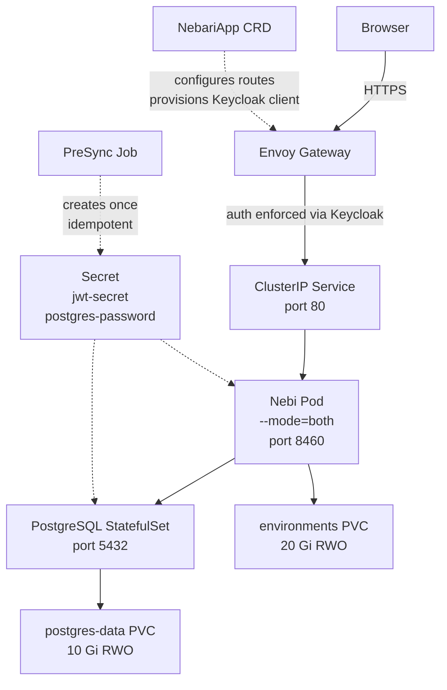

# Architecture

## Component diagram

## Kubernetes resources

| Resource | Kind | Notes |
|---|---|---|
| `<release>` | Deployment | Nebi server, `--mode=both` (API + background worker in one pod). Listens on port 8460. |
| `<release>` | Service | ClusterIP, port 80 → 8460. |
| `<release>-environments` | PersistentVolumeClaim | 20 Gi RWO. Stores pixi workspace environment files at `/app/data/environments`. |
| `<release>-postgres` | StatefulSet | PostgreSQL 16, 1 replica. |
| `<release>-postgres` | Service | Headless (ClusterIP: None), port 5432. Provides stable DNS for the StatefulSet. |
| `<release>` | Secret | Contains `jwt-secret` and `postgres-password`. Created by the PreSync Job — never managed by Helm directly. |
| `<release>` | NebariApp | Only when `nebariapp.enabled: true`. Registers the service with `nebari-operator`. |
| `<release>` | ServiceAccount | Bound to the Nebi Deployment. |
| `<release>-secret-init` | Job + Role + RoleBinding + ServiceAccount | ArgoCD PreSync hook. Creates the Secret idempotently on first sync, then deletes itself. |

## Request flow

1. The user's browser sends an HTTPS request to `https://nebi.your-cluster.example.com`.
2. Envoy Gateway intercepts the request. The `NebariApp` CRD has provisioned a Keycloak OIDC client; unauthenticated requests are redirected to Keycloak login.
3. After login, Envoy Gateway forwards the request to the Nebi `ClusterIP` Service on port 80.
4. The Service routes traffic to the Nebi pod on port 8460.
5. The Nebi pod serves the React frontend and REST API. Workspace operations read and write the environments PVC; all application state is persisted in PostgreSQL.

## Secret bootstrap

ArgoCD renders Helm templates client-side before applying them. This means `lookup()` always returns nil and `randAlphaNum` generates new values on every sync — making stable random secrets impossible inside a Helm template when managed by ArgoCD ([upstream issue](https://github.com/argoproj/argo-cd/issues/5202)).

This chart uses an ArgoCD **PreSync hook Job** instead:

- The Job runs `kubectl create secret` _before_ any other resources are applied.
- It checks whether the secret already exists and **skips creation** if it does.
- Because the Secret is created outside Helm's managed resource set, ArgoCD never diffs or overwrites it.
- On plain `helm install` (non-ArgoCD), the Job still runs as a normal Kubernetes Job with the same idempotent behavior.

## Single-pod vs. split-mode

The upstream [nebi](https://github.com/nebari-dev/nebi) Helm chart separates the API server and background worker into two Deployments sharing an RWX PVC. This pack uses `--mode=both` in a single Deployment, which is appropriate for typical Nebari cluster sizes because:

- No RWX storage class required — RWO is sufficient.
- No Valkey/Redis dependency — the in-memory queue (`queue.type: memory`) is adequate for a single replica.
- Simpler operational model: one pod to monitor and one PVC to back up.

To scale beyond a single replica, use the upstream chart directly with a split-mode configuration and an RWX-capable StorageClass.
